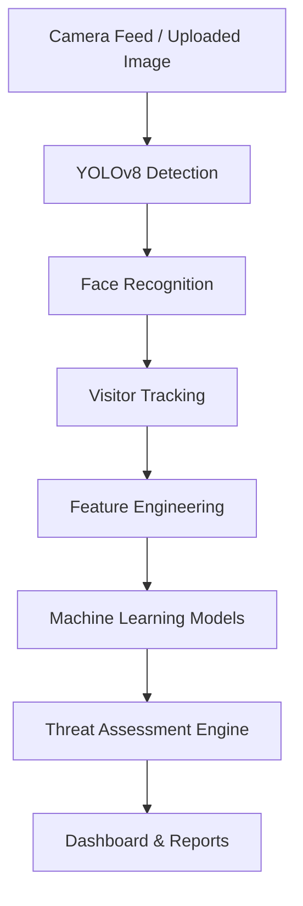
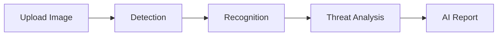

# 🚀 Intel-Optimized AI-Powered Visitor Detection, Tracking, Threat Assessment & Image Intelligence Surveillance System

<p align="center">
  
</p>

<p align="center">
  <b>Transforming Traditional Surveillance into Intelligent Security Intelligence</b>
</p>

<p align="center">
  
  
  
  
  
  
</p>

---

## 📖 Overview

Traditional CCTV systems only record video. This project converts surveillance into an AI-powered intelligence platform capable of:

- Real-time visitor detection
- Face recognition
- Visitor tracking
- Threat assessment
- Anomaly detection
- Crowd intelligence
- Image & screenshot analysis
- AI-generated security reports

---

## ✨ Key Features

| Feature | Description |
|----------|-------------|
| 👤 Visitor Detection | YOLOv8-powered real-time detection |
| 🧠 Face Recognition | Known vs Unknown visitor identification |
| 🔄 Tracking | Persistent visitor IDs |
| 🚨 Threat Assessment | Risk scoring engine |
| 📊 Analytics Dashboard | Visitor trends and heatmaps |
| 🖼️ Image Analyzer | Upload image and receive AI report |
| 📸 Screenshot Analyzer | Analyze captured surveillance frames |
| ⚡ OpenVINO | Intel-optimized inference |

---

## 🏗 System Architecture



---

## 🎬 Demo

### Dashboard


### Detection


### Image Analyzer


---

## 🛠 Tech Stack

| Layer | Technologies |
|---------|-------------|
| Frontend | React |
| Backend | FastAPI |
| Database | SQLite / PostgreSQL |
| CV | YOLOv8, OpenCV |
| ML | Random Forest, Isolation Forest, K-Means |
| Optimization | Intel OpenVINO, Intel oneAPI |
| Deployment | Docker |

---

## 🤖 Machine Learning Models

### Random Forest
Classifies visitor behavior as Normal or Suspicious.

### Isolation Forest
Detects anomalous behavior such as loitering and unusual movement.

### K-Means
Segments visitors into behavioral groups.

### Forecasting
Predicts visitor volume and peak hours.

---

## 🖼️ Image Intelligence Analyzer



Outputs:

- People Count
- Known Visitors
- Unknown Visitors
- Threat Score
- Recommendations

---

## ⚡ Intel OpenVINO Acceleration

| Metric | Standard | OpenVINO |
|----------|----------|----------|
| FPS | 18 | 42 |
| Latency | High | Low |
| CPU Utilization | Moderate | Optimized |

---

## 📂 Project Structure

```text
cv_module/
backend/
frontend/
ml_models/
data_pipeline/
utils/
data/
```

---

## 🚀 Installation

```bash
git clone <repo-url>
cd project

python -m venv .venv
source .venv/bin/activate
pip install -r requirements.txt
```

### Run Backend

```bash
python run_backend.py
```

### Run Real-Time Detection

```bash
python run_realtime.py --source 0
```

### Train Models

```bash
python train_models.py --from-db
```

---

## 📡 APIs

| Endpoint | Description |
|----------|-------------|
| /api/analyze-image | Analyze uploaded image |
| /api/alerts | Alerts |
| /api/analytics | Analytics |
| /api/threat | Threat assessment |
| /api/export | Export reports |

---

## 🌍 Use Cases

- Airports
- Smart Cities
- Hospitals
- Universities
- Shopping Malls
- Corporate Offices
- Government Facilities

---

## 🎯 SDG Alignment

- SDG 9 – Industry, Innovation & Infrastructure
- SDG 11 – Sustainable Cities & Communities
- SDG 16 – Peace, Justice & Strong Institutions

---

## 🛣 Roadmap

- [x] Visitor Detection
- [x] Face Recognition
- [x] Threat Assessment
- [x] Image Intelligence
- [ ] Drone Surveillance
- [ ] AI Security Assistant
- [ ] Predictive Threat Analytics
- [ ] Smart City Integration

---

## 📈 Performance Metrics

| KPI | Value |
|------|------|
| Detection Accuracy | 95%+ |
| Recognition Accuracy | 90%+ |
| Threat Detection Rate | 88%+ |
| OpenVINO Speedup | 2–4x |

---

## 🤝 Contributing

Contributions are welcome.

1. Fork repository
2. Create feature branch
3. Commit changes
4. Open Pull Request

---

## 📜 License

MIT License

---

## 👨‍💻 Author

**Riya Raina**

- GitHub: https://github.com/
- LinkedIn: https://linkedin.com/
- Portfolio: https://your-portfolio.com

---

⭐ If you find this project useful, consider giving it a star.
